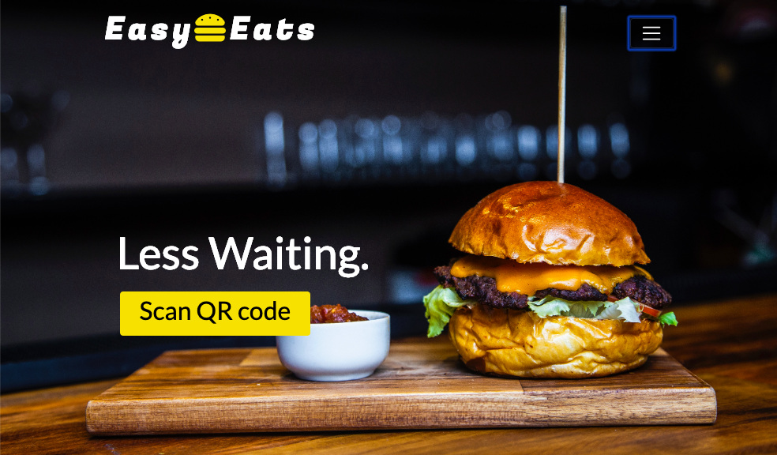

# Easy Eats

 

A progressive web application that makes it easy for hungry customers to take immediate action. Ultimately improving the customer experience during the users visit to a restaurant.

## How it works

Easy Eats works in correlation with restaurants to allow customers to order food without a server. When customers are seated at a table, they have the option of scanning a QR code that brings them to the Easy Eats application. Once they have signed up/ logged in they are presented with the menu where they can place their order.

The restaurant has two of their own log in authentication with the Easy Eats application. They can sign in as a 'manager' or 'kitchen'. The manager's dashboard has the ability to view orders, view the menu, add items to the menu, and also edit menu items.

The kitchen's dashboard dislpays all current orders. The kitchen has the ability to change the status of each order from pending to in process, completed, or canceled.

### Contact
If you have any problems, question, ideas, or suggestions please contact us how you see fit:

Will Rackley - willrackley65@gmail.com
Natosha Martin - nmsuri28@gmail.com
Justas Lauzinskas - justaslau@gmail.com

### Deployed Heroku Domain
[click here to try Easy Eats web application](https://shrouded-waters-91830.herokuapp.com/)